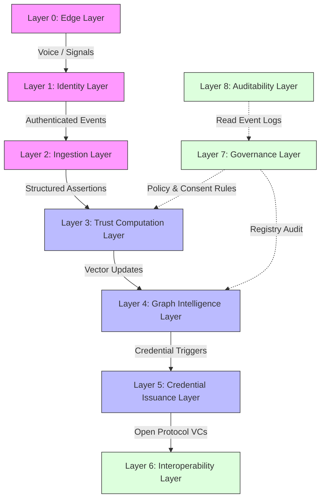
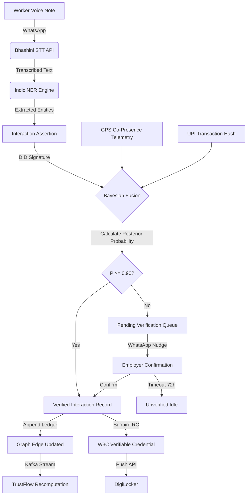
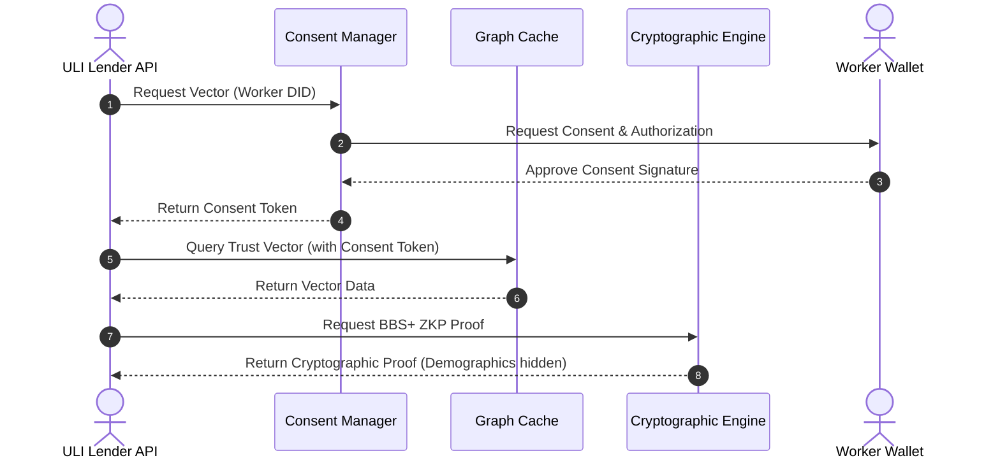

# KaamDhaam: Portable Computational Trust Infrastructure for Informal Economies

KaamDhaam is a population-scale Digital Public Infrastructure (DPI) protocol designed to compute, store, propagate, and govern economic trust for informal labor markets. The infrastructure serves as a decentralized, self-sovereign trust ledger that enables India's 450 million informal workers to convert their transaction history, peer endorsements, and vocational competencies into portable, cryptographically verified credentials. By removing information asymmetry, KaamDhaam integrates workers directly with formal financial services (via the Unified Lending Interface) and competitive job markets (via ONEST/Beckn).

---

## 1. Core Philosophy and Foundational Abstraction

KaamDhaam does not compute ratings. A rating is a subjective, scalar, human-assigned, and manipulable value. Instead, the protocol computes a multi-dimensional, time-weighted, graph-propagated probability distribution over an actor's economic behavior across distinct vocational and behavioral domains.

Formally, KaamDhaam operates as a Distributed Probabilistic Economic State Machine. Its global state is modeled as a trust graph:

$$G(V, E, R, t)$$

Where:
- $V$ is the set of economic actors (workers, contractors, MSMEs, households, skilling hubs).
- $E$ is the set of verified economic interactions.
- $R$ is the function mapping every node to its current multi-dimensional reputation vector.
- $t$ is the global logical clock of the system.

### 1.1 Irreducible Atomic Primitives

The protocol defines exactly six irreducible primitives from which all trust relations emerge:

1. **Economic Identity (EI):** A cryptographically self-sovereign, globally unique W3C Decentralized Identifier (DID) representing a real-world actor. An EI carries zero inherent trust at genesis.
2. **Interaction Assertion (IA):** A self-declared, unverified claim of an economic interaction between two or more EIs.
3. **Verification Signal (VS):** Objective, externally-sourced data (e.g., UPI transaction references, GPS telemetry, voice records) that corroborate or contradict an Interaction Assertion.
4. **Verified Interaction Record (VIR):** An immutable record generated when one or more Verification Signals push the Bayesian posterior probability of an Interaction Assertion above the authentication threshold ($P \geq 0.90$).
5. **Trust Vector (TV):** A continuously updated, multi-dimensional reputation vector assigned to each EI, calculated dynamically from the network of VIRs. Trust Vectors are not stored permanently; they are recomputed from the append-only ledger.
6. **Verifiable Credential (VC):** A W3C-compliant cryptographic attestation of a Trust Vector snapshot, issued by an authorized node at a specific logical timestamp for external presentation.

### 1.2 Core Invariants

The system maintains the following absolute, non-negotiable architectural guarantees:
- **Sovereignty:** Only the key-holder can present, modify, or revoke credentials associated with their DID.
- **Immutability of Evidence:** VIRs are append-only. Disputes generate counter-evidence nodes instead of deleting historical data.
- **Convergence:** The TrustFlow algorithm is mathematically guaranteed to converge to a unique fixed-point, avoiding oscillation.
- **Seed Anchoring:** All trust propagation paths must trace back to at least one verified institutional seed node within $k$ hops (default: $k = 5$).
- **Proportionality:** The decay architecture ensures a mathematical floor above zero for any actor with a verified positive VIR in the rolling 24-month window, preventing permanent zeroing.
- **Demographic Blindness:** The trust graph topology excludes caste, gender, religion, and ethnicity. Demographic markers are kept in the sovereign wallet off-graph and never flow into trust computations.

---

## 2. Macro-Layer Architecture

KaamDhaam is organized into nine horizontal layers. Control signals flow upward (governance to computation) and data flows downward (ingest to compute to issuance). No layer has direct access to non-adjacent layers.

```
┌─────────────────────────────────────────────────────────────────────┐
│  LAYER 0 — EDGE LAYER                                               │
│  WhatsApp Bot │ IVR Gateway │ QR Scanner │ Offline BLE Sync         │
└────────────────────────────────┬────────────────────────────────────┘
                                 │ Verified Signal Streams
┌────────────────────────────────▼────────────────────────────────────┐
│  LAYER 1 — IDENTITY LAYER                                           │
│  DID Registry (did:web / did:key) │ Aadhaar eKYC Bridge             │
│  Sunbird RC Issuance Node │ DigiLocker Push API                      │
└────────────────────────────────┬────────────────────────────────────┘
                                 │ Authenticated Event Streams
┌────────────────────────────────▼────────────────────────────────────┐
│  LAYER 2 — INGESTION LAYER                                          │
│  Bhashini STT Pipeline │ NER/Skill Extraction │ Signal Classifier   │
│  UPI Hash Resolver │ GPS Co-Presence Engine │ Kafka Event Bus        │
└────────────────────────────────┬────────────────────────────────────┘
                                 │ Structured Interaction Assertions
┌────────────────────────────────▼────────────────────────────────────┐
│  LAYER 3 — TRUST COMPUTATION LAYER                                  │
│  Bayesian Signal Fusion │ TrustFlow Engine │ Temporal Decay Daemon  │
│  Confidence Interval Calculator │ Fraud Signal Detector             │
└────────────────────────────────┬────────────────────────────────────┘
                                 │ Trust Vector Updates
┌────────────────────────────────▼────────────────────────────────────┐
│  LAYER 4 — GRAPH INTELLIGENCE LAYER                                 │
│  FalkorDB/Neo4j Graph Cluster │ PageRank/TrustRank Engine           │
│  Graph GNN Fraud Detector │ Cluster Emergence Monitor               │
└────────────────────────────────┬────────────────────────────────────┘
                                 │ Credential Issuance Triggers
┌────────────────────────────────▼────────────────────────────────────┐
│  LAYER 5 — CREDENTIAL ISSUANCE LAYER                                │
│  W3C VC Generator │ BBS+ Signature Engine │ Revocation Registry     │
│  ZKP Proof Generator │ DigiLocker Push │ ONEST/Beckn Publisher       │
└────────────────────────────────┬────────────────────────────────────┘
                                 │ Open Protocol Exposure
┌────────────────────────────────▼────────────────────────────────────┐
│  LAYER 6 — INTEROPERABILITY LAYER                                   │
│  ONEST/Beckn DSEP Gateway │ ULI Lender API │ Account Aggregator FIP │
│  EUDI VC Bridge │ eShram Sync │ Skill India Digital Hub Connector    │
└────────────────────────────────┬────────────────────────────────────┘
                                 │ Policy Enforcement Signals
┌────────────────────────────────▼────────────────────────────────────┐
│  LAYER 7 — GOVERNANCE LAYER                                         │
│  DPDP Consent Manager │ Dispute ODR Engine │ Bias Audit Monitor     │
│  Protocol Upgrade Council │ Seed Node Registry Authority            │
└────────────────────────────────┬────────────────────────────────────┘
                                 │ Audit Events
┌────────────────────────────────▼────────────────────────────────────┐
│  LAYER 8 — AUDITABILITY LAYER                                       │
│  Immutable Event Log (append-only) │ Algorithmic Decision Explainer │
│  Public Transparency Dashboard │ Regulatory Reporting API           │
└─────────────────────────────────────────────────────────────────────┘
```

Below is the computational layers data control mapping:



### 2.1 Critical Path Data Flows

#### Trust Ingest Flow



1. A worker sends a voice note via WhatsApp.
2. The Bhashini STT pipeline converts audio to text across Indian languages.
3. The Indic NER Engine extracts entities: skills, dates, wages, locations, and employer details.
4. An Interaction Assertion (IA) is created and signed by the worker's DID.
5. Passive telemetry verifies co-presence via GPS co-location or UPI payment hash matching through Account Aggregators.
6. The Bayesian fusion service computes the posterior probability:
   - If $P \geq 0.90$, a Verified Interaction Record (VIR) is appended to the ledger.
   - If $P < 0.90$, the event is placed in a "Pending Verification" queue, and the employer is prompted via WhatsApp for manual confirmation. If no response occurs within 72 hours, it is marked as "Unverified Idle".
7. Graph edge weights are updated asynchronously via Kafka.
8. The TrustFlow engine schedules a recomputation.
9. A W3C Verifiable Credential is issued via Sunbird RC and pushed to the worker's DigiLocker.

#### Trust Query Flow



1. A lender requests the Trust Vector via ULI API: `GET /trust/v1/worker/{did}/vector`.
2. The DPDP Consent Manager verifies the worker's digital consent.
3. If consent is valid, the system retrieves the Trust Vector from the graph cache.
4. The BBS+/ZKP generator constructs a zero-knowledge proof of competency without exposing the worker's demographics or complete work history (e.g., proving the worker's electrical rating is $\geq 0.85$ and dispute rate is $\leq 0.05$).
5. The API responds with the proof, confidence intervals, and vector freshness logical clock.

---

## 3. Computational Trust Engine

Every actor $i$ is mapped to a multi-dimensional reputation vector $R[i] \in \mathbb{R}^E$, where $E$ represents the dimensions of the vocational and behavioral embedding space.

### 3.1 TrustFlow Update Equation

The propagation of trust through the economic graph is calculated using the contractive update formulation:

$$R^{(t+1)}[j] = \alpha \sum_{i \in \text{In}(j)} w(i \to j) \cdot f(R^t[i], e_{ij}) + (1 - \alpha) T[j] + C[j]$$

Where:
- $\alpha = 0.85$ is the damping factor that bounds propagation hops.
- $w(i \to j)$ is the normalized weight of UPI-anchored transactions flowing from $i$ to $j$.
- $e_{ij} \in \mathbb{R}^E$ is the interaction embedding vector extracted by the NLP/NER pipeline.
- $f(R^t[i], e_{ij})$ is the Lipschitz-1 skill-gated transfer operator, defined as:

$$f(R^t[i], e_{ij}) = \max\left(0, \frac{R^t[i] \cdot e_{ij}}{\|R^t[i]\|_2}\right) \cdot e_{ij}$$

The transfer operator ensures that reputation can only flow in dimensions where the endorser has established, positive reputation.
- $T[j]$ is the Personalized TrustRank teleportation vector, seeded exclusively from verified institutional nodes $S$:

$$T[j] = \begin{cases} \frac{1}{|S|} & \text{if } j \in S \\ 0 & \text{otherwise} \end{cases}$$

- $C[j]$ is the exogenous economic injection, mapped from transaction volume:

$$C[j] = \log(1 + \mu \cdot \text{Volume}_{\text{UPI}}(j)) \cdot \mathbf{1}_E$$

### 3.2 Convergence Guarantee

The update operator $\Phi: \mathbb{R}^{|V| \times E} \to \mathbb{R}^{|V| \times E}$ is a strict contraction on the $L_1$ metric space. By the Banach Fixed-Point Theorem, this ensures convergence to a unique fixed point $R^*$ for any valid input graph. Under power iteration, convergence to $\epsilon = 0.001$ precision is reached in 15 to 30 iterations for a graph of $10^7$ nodes.

### 3.3 Temporal Decay

Reputation decays exponentially with inactivity, reducing vector magnitude while preserving direction:

$$\|R^t_{\text{decayed}}[j]\|_2 = \|R^t[j]\|_2 \cdot \exp(-\lambda (t - t_{\text{last\_active}}))$$

Decay rates ($\lambda$ per day) vary by domain:
- **Skill Competency (e.g., Masonry, Wiring):** $\lambda = 0.0019$ (half-life of 365 days).
- **Behavioral Punctuality:** $\lambda = 0.0069$ (half-life of 100 days).
- **Dispute-free Record:** $\lambda = 0.0046$ (half-life of 150 days).
- **Transaction Recency:** $\lambda = 0.0139$ (half-life of 50 days).

### 3.4 Confidence Intervals

Each Trust Vector is paired with a Confidence Interval $\text{CI}[j] \in [0, 1]$:

$$\text{CI}[j] = 1 - \frac{1}{\sqrt{d_{\text{in}}(j) + \beta \cdot H(R[j])}}$$

Where:
- $d_{\text{in}}(j)$ is the in-degree from distinct, non-overlapping network neighborhoods.
- $H(R[j])$ is the Shannon entropy of the incoming reputation distribution.
- $\beta = 0.5$ is a normalization constant.

An actor with a high Trust Vector but low CI indicates an insular network. Underwriting applications require a $\text{CI} \geq 0.40$ to process queries.

### 3.5 Migration Portability

Geographic migration is handled by a transfer operator that blends global reputation with local neighborhood metrics:

$$R_{\text{migrated}} = \theta \cdot R_{\text{global}}[j] + (1 - \theta) \sum_{k \in \text{Local}(j)} R[k]$$

Where:
- $\theta \to 1.0$ for verified skills (globally portable).
- $\theta \to 0.5$ for behavioral locality signals (requiring local recalibration).
- $\theta = 0.75$ serves as the default for mixed profiles.

---

## 4. Economic Graph Architecture

The trust graph is a directed, weighted, heterogeneous multigraph containing several classes of economic actors:

| Node Class | Symbol | Trust Role | Seed Eligible |
|---|---|---|---|
| Worker | W | Primary trust subject | No |
| Contractor / Thekedar | C | Trust intermediary | Conditionally |
| MSME / Registered Enterprise | M | High-trust employer | Yes |
| Household Consumer | H | End consumer | No |
| Lender / Bank / NBFC | L | Trust consumer | No |
| Skilling Institution / BOCW | S | Foundational seed node | Yes (Primary) |
| NGO / Trust Agent | N | Field verification agent | Yes (Regional) |

### 4.1 Edge Taxonomy and Weights

- `WORKED_WITH` (W $\to$ C/H): Weight based on task duration, complexity, and rating. Verified via signed JSON-LD VC.
- `PAID_BY` (C/H $\to$ W): Weight derived from log-normalized UPI transaction amount. Anchored via Account Aggregator reference hashes.
- `PEER_VALIDATED` (W $\leftrightarrow$ W): EPhemeral BLE/QR handshake weight, scaled by geographical co-presence duration and vocational alignment.
- `REFERRED_BY` (W $\to$ W): Scaled by sender's TrustRank magnitude.
- `DISPUTED_BY` (C/H $\to$ W): Multiplier of $-5.0 \times$ local edge magnitude. Managed via cryptographic dispute certificates and ODR arbitration.
- `CERTIFIED_BY` (S/N $\to$ W): Fixed weight based on institutional certification tier.

### 4.2 Graph Partitioning and Fraud Defense

To scale past 300 million nodes, KaamDhaam implements a three-tier partitioning model:
1. **Geographic Shards:** 28 state-level partitions. Cross-shard references use lightweight pointers referencing remote compressed vectors.
2. **Vocational Sub-graphs:** Parallel clusters (construction, domestic work, logistics) within geographic shards to isolate local computational workloads.
3. **Hot/Cold Storage Separation:** In-memory graph databases (FalkorDB) host nodes active in the last 90 days, warm storage (Neo4j SSD) hosts nodes active within 90–365 days, and compressed snapshots are exported to cold object storage.

The Graph Intelligence Layer executes continuous detection algorithms:
- **Louvain Community Bipartiteness:** Flags near-bipartite collusion groups (e.g., workers validating each other without external payments or work records) when the bipartiteness coefficient falls below $0.30$.
- **Triadic Closure Auditing:** Down-weights `PEER_VALIDATED` edges when triangle density is high but capital flow (`PAID_BY` edges) is below 10% of the regional baseline.
- **Quarantine Gating:** Isolates nodes that accumulate high trust vectors but lack a path trace to a verified seed node within $5$ hops.

---

## 5. Signal Ingestion and Multimodal Verification

### 5.1 Signal Reliability Hierarchy

To protect against manipulation, KaamDhaam requires at least two independent signals from different reliability tiers to authenticate an interaction:

| Signal Type | Tier | Fraud Resistance | Verification Mechanism | CI Contribution |
|---|---|---|---|---|
| UPI Transaction Hash | Tier 1 | Very High | Account Aggregator consent | +0.35 |
| Institutional VC | Tier 1 | Very High | Sunbird RC Issuer signature | +0.30 |
| Voice Log (Semantic) | Tier 2 | Medium | Bhashini STT + Indic NER | +0.15 |
| GPS Co-Presence ($\geq$ 3h) | Tier 2 | Medium | Passive device telemetry | +0.15 |
| Peer QR/BLE Handshake | Tier 3 | Medium | Device-local signature | +0.10 |
| EXIF-verified Work Image | Tier 3 | Low | Cryptographic metadata | +0.05 |
| Metadata Recurrence | Tier 4 | Low | Communication logs | +0.03 |

### 5.2 Bayesian Signal Fusion

The system computes the posterior probability of a work event $E_{ij}$ occurring given multiple signals:

$$P(E_{ij} \mid S_{\text{UPI}}, S_{\text{GPS}}, S_{\text{Voice}}) = \frac{P(S_{\text{UPI}} \mid E_{ij}) \cdot P(S_{\text{GPS}} \mid E_{ij}) \cdot P(S_{\text{Voice}} \mid E_{ij}) \cdot P(E_{ij})}{P(S_{\text{UPI}}, S_{\text{GPS}}, S_{\text{Voice}})}$$

Using empirical conditional likelihoods (e.g., $P(S_{\text{UPI}} \mid \text{event}) = 0.99$, $P(S_{\text{UPI}} \mid \text{fabricated}) = 0.01$), the system transitions the Interaction Assertion to a Verified Interaction Record (VIR) only when $P \geq 0.90$.

---

## 6. Cryptography, Identity, and Consent

### 6.1 DID Methodology

- **Workers:** `did:key` methodology. Generated on-device during registration. Private keys reside in the hardware-backed Trusted Execution Environment (TEE) of the mobile device.
- **Institutions (MSMEs, skilling centers, NGOs):** `did:web` methodology. Resolved via subdomains linked to their business credentials (e.g., GSTIN).

### 6.2 Selective Disclosure and ZKPs

To prevent pre-contract discrimination and comply with the DPDP Act 2023, KaamDhaam implements selective disclosure through BBS+ multi-message signatures. A worker can prove:
- `trust_vector.masonry` $\geq 0.80$
- `verified_interactions` $\geq 20$
- `dispute_rate` $\leq 0.02$

The proof hides the worker's name, gender, caste, age, and previous employer identity.

For credit underwriting, the system generates zero-knowledge proofs (ZKP) using Groth16 over BN-254 curves:

$$\pi = \text{ZKP}\left(R_j.\text{domain} \geq \theta \land \text{CI}_j \geq 0.60 \land \text{VIR\_count\_90d} \geq 10\right)$$

This allows financial institutions on the Unified Lending Interface (ULI) to verify creditworthiness without accessing raw transaction histories.

---

## 7. AI and NLP Pipeline

Informal workers interact with KaamDhaam via voice notes. The transcription and entity extraction are handled in a structured pipeline:

```
[Voice Note (.ogg Opus)]
         │
         ▼
[Bhashini STT API] ───► Translates 22 Indian languages and code-mixed dialects
         │
         ▼
[Indic NER Engine] ───► Fine-tuned LLaMA 3.1 8B (INT4 quantized)
         │               Extracts: Employer, Skill, Wage, Location, Date
         ▼
[Ontology Alignment] ─► Maps skills to NSQF (National Skills Qualification Framework)
         │
         ▼
[JSON-LD Assertion] ──► Structured W3C format for Ingestion
```

The system maps vocational attributes to a structured skill ontology with 2,400 leaf nodes. AI safety rules prevent the extraction of demographic properties (caste, religion, gender, or political affiliation) from voice or location records.

---

## 8. Phase-by-Phase Implementation Roadmap

The deployment of KaamDhaam is structured in four successive phases to manage computational complexity, validate security assumptions, and grow the network.

### Phase 1: Minimum Viable Product (MVP) - Noida Pilot (Months 1–2)

The MVP is designed as a localized trial to test voice ingestion, STT/NER processing, and the basic TrustFlow engine on a small, controlled cohort of workers.

- **Target Cohort:** 200 electricians in Noida Sector 58.
- **Vocational Scope:** 5 basic trades (HVAC, electrical, plumbing, carpentry, masonry).
- **Edge Interface:** A single WhatsApp Business API webhook running in Hindi and regional code-mixed speech.
- **Ingestion & Verification:** Bhashini STT translates Hindi audio, and an Indic NER model extracts basic entities. UPI transaction hashes are verified manually or through a single Mock Account Aggregator endpoint.
- **Trust Computation:** Single-node FalkorDB instance running a localized PageRank variant.
- **Credential Issuance:** Cryptographic-QR-embedded PDF credentials generated on the server and sent back to workers via WhatsApp. DigiLocker and Sunbird RC are deferred.
- **Fraud Prevention:** Rule-based heuristics to flag rapid successive attestations.
- **Success Metrics:**
  - 150 verified VIRs written to the database.
  - 5 unique local employers actively validating transactions.
  - 1 Mock ULI API credit inquiry successfully resolved.

### Phase 2: Pilot Expansion and Decentralized Identity (Months 3–6)

Phase 2 introduces decentralized identity standards, sovereign key management, and expands the pilot cohort to multiple metropolitan areas.

- **Target Cohort:** 10,000 workers across 5 metropolitan areas (Delhi NCR, Mumbai, Bengaluru, Pune, Ahmedabad).
- **Identity Infrastructure:** Deploy `did:key` generation on the Android client app. Implement Aadhaar eKYC binding via one-way cryptographic hashing to prevent duplicate identity generation.
- **Credential Infrastructure:** Integrate Sunbird RC node for standard JSON-LD W3C Verifiable Credential generation. Establish the revocation registry and status list.
- **NLP Improvements:** Expand the Bhashini/NER pipeline to support 5 additional regional languages (Marathi, Gujarati, Kannada, Tamil, Telugu).
- **Dispute Resolution:** Deploy the Tier 1 and Tier 2 Online Dispute Resolution (ODR) engine with assisted human reviewers.
- **Fraud & Security:** Deploy a GraphSAGE GNN model with 3 aggregation layers to detect bipartite collusion rings and triadic closure anomalies.

### Phase 3: Scale Phase and Fintech Integration (Months 6–12)

Phase 3 focuses on scale, high-availability architecture, and integration with formal financial institutions.

- **Target Cohort:** 100,000 verified workers.
- **System Architecture:** Migrate the services to AWS EKS (Kubernetes) with dedicated node pools for ingestion, graph operations, cryptography, and Kafka event routing.
- **Interoperability:** Launch the ONEST/Beckn DSEP gateway to publish worker profiles to open gig networks.
- **Financial Integration:** Partner with 1 NBFC/Lender via the Unified Lending Interface (ULI).
- **Cryptographic Enhancements:** Implement BBS+ selective disclosure signatures and deploy Groth16/BN-254 Zero-Knowledge Proof (ZKP) generation for private underwriting queries.
- **DigiLocker Integration:** Implement DigiLocker push and pull APIs to synchronize issued credentials directly to workers' government digital wallets.

### Phase 4: National DPI Integration (Years 2–5)

Phase 4 transitions KaamDhaam into a national infrastructure, scaling to millions of workers and achieving deep integration with government registries.

- **Target Cohort:** 50 million active workers, 300 million registered profiles.
- **Infrastructure Scale:** Deploy a multi-region active-active Kubernetes topology. Implement geographic and vocational graph partitioning across FalkorDB and Neo4j SSD arrays.
- **National Registry Linkage:** Integrate eShram API to seed profiles using eShram UAN credentials.
- **Financial Scale:** Connect the ZKP-based Trust Score API directly to 10+ major national banks and financial institutions via RBI ULI.
- **International Portability:** Build the EUDI VC bridge to make Indian trust credentials portable to EU, Gulf, and Southeast Asian labor markets.

---

## 9. Governance, Security, and Compliance

### 9.1 DPDP Act 2023 Compliance
- **Data Minimization:** Raw voice notes, GPS coordinates, and payment records are deleted within 30 days of ingestion. Only derived cryptographic VIRs and anonymous graph relationships persist.
- **Purpose-Bound Consent:** Underwriting queries require a signed consent token from a registered Consent Manager, detailing the data principal, the data fiduciary, the loan amount, and the retention period.
- **Right to Erasure:** Workers can request profile erasure. Personal identifiers are deleted, and active DIDs in the graph are replaced with one-way hashes to maintain the structural continuity of the network.

### 9.2 Ethical Invariants
- **No Demographic Bias:** Caste, gender, religion, and ethnicity data are excluded from graph nodes. The Demographic Parity Monitor audits the Wasserstein distance between cohort distributions and triggers alerts if divergence exceeds 1.5 standard deviations.
- **No Permanent Locks:** Permanent blacklisting is prohibited. The system maximum sanction is temporary quarantine, which requires human reviewer authorization.
- **No Surveillance Integration:** The API layer restricts access to verified economic actors and rejects queries originating from state security and surveillance endpoints.
- **Right to Explanation:** Workers have a statutory right to receive a plain-language explanation of trust score movements in their local language within 48 hours.

---

## 10. Technology Stack Summary

| Component | Standard Technology | Scale Alternative |
|---|---|---|
| **Graph Database** | FalkorDB (Hot), Neo4j (Warm) | TigerGraph |
| **Event Streaming** | Apache Kafka | Apache Pulsar |
| **STT & Translation** | Bhashini API | Google Cloud STT |
| **NER Model** | Indic LLaMA 3.1 8B (INT4) | Custom spaCy Pipeline |
| **Identity & VC** | Sunbird RC | Veramo Framework |
| **ZKP Proving** | Groth16 / BN-254 | PLONK |
| **Identity Wallets** | DigiLocker Push, Inji Wallet | Universal Wallet API |
| **Edge Sync** | MQTT over TLS | WebSockets |
| **Container Engine** | AWS EKS | GCP GKE |
